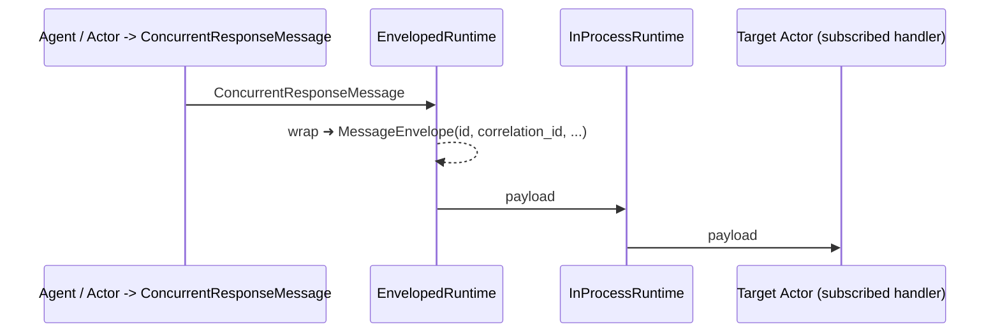

# Multi-agent Orchestration ADR Feedback from evmattso

[Doc](https://github.com/microsoft/semantic-kernel/blob/multi-agent-orchestration-adr/docs/decisions/00xx-multi-agent-orchestration.md)

General comments
---

- **Terminology**: Rewrite the terminology section around a shared runtime abstraction; drop “AutoGen agent” phrasing. Don’t tie to AutoGen-specific usage/terms—since we’re moving towards a shared runtime, let's start reflecting that now.
- **Message types**: Move message types to a table in the appendix; perhaps keep the core section conceptual and decouple details.
- **Target Audience section**: What are we really trying to convey? It currently lacks impact—consider alternative ways to communicate the intended message.
- **Problem Statement**: Expand to highlight scalability pain-points (lack of scalable OOB patterns, reason-about-state, routing overhead, observability gaps, guardrails) rather than simply “we don’t have multi-agent yet.”
    - Make success criteria explicit: what does success look like if we introduce these new patterns?
    - **Positioning vs. Existing Patterns**: The draft positions orchestrations as an evolution of “patterns,” but stops using that term later—is that intentional?

Terminology
---

- **Actor vs. Agent**: Define once, not per table cell. Consider a simple two-level taxonomy:  
    1. *Execution Roles* (runtime, actors)  
    2. *Application Roles* (agents, orchestrations)
- **“Orchestration” vs. “Runtime”**: make runtime purely transport (pub-sub, lifecycle, fault domain), while orchestration is logical control flow (graph, termination, aggregation).
- **Message namespace guidance**: good start - can we also document the serialization contract (TypedDict/dataclass/pydantic model) and versioning strategy?

Architecture
---

- **Message Layer**: Enumeration of message types per orchestration is good, but placing it in the Appendix would help decouple concept from mechanics.
- **Graph-as-Code**: The “lazy evaluation” paragraph hints at a DAG-builder but lacks detail. What more information do we need here?
- **Default aggregator**: Will there be a default aggregator for concurrent steps? Is this shown in the sample code you provided?

Structured I/O typed
---

Can we propose a concrete contract to discuss in the document?  
For example:

```python
@dataclass
class Invocation[TIn, TOut]:
    params: TIn
    result: Future[TOut]
```

Generics
---

- Although we can get types in-memory, there is type erasure at runtime (as previously discussed). We should persist qualified class names for state/resumability.
- The FQN is persisted in Processes, which can be leveraged as needed.

State & Check-pointing
---

- Distinguish conversation state (per agent) vs. process state (per orchestration instance).
- Recommend a state provider contract (`save_state`, `load_state`) with adapters for storage providers. This was removed from the lower-level runtime to allow agents/orchestration to define it.
- Should we add an idempotent retry/re-entry guideline (actors replay last message idempotently)?

Patterns
---

Other patterns to support (not necessarily v1):

- **Plan-and-Execute (ReAct)**: LLM builds a task plan and delegates sub-tasks—can extend Sequential with dynamic expansion.
- **Map-Reduce**: Classic fan-out/fan-in summarization or data extraction. Needs an aggregator actor that deterministically merges partials.
- **Voting/Consensus**: An ensemble of agents proposes answers, and an aggregator chooses via rule (majority, confidence).

Envelope Abstraction Thoughts
---

Having reviewed your code further - what if we add an abstraction to decouple how messages are passed between the runtime? This may be better suited for the shared `agent-runtime` library, but I wanted to bring it up here.

For example, we can introduce a `MessageEnvelope[TPayload]` wrapper at the runtime boundary.

**Potential benefits:**

- **Runtime/domain decoupling**: Actors focus on business-logic objects (like `ConcurrentRequestMessage`). The runtime only sees envelopes, so changing transports (in-proc, distributed) or injecting middleware (tracing, guardrails) requires no orchestration code changes.
- **Built-in idempotency & retries**: Envelope carries `id`, `causation_id`, `retry_count`, `ttl`—enabling deterministic deduplication, causal graphs for telemetry, and safe redelivery (dead letter queue support).
- **First-class observability**: Envelope fields can map 1:1 to OpenTelemetry attributes for traceability and metrics on every hop.
- **Cross-language portability**: A single JSON/Protobuf schema allows, for example, Python and C# SK agents to interoperate on the same message bus; envelope remains the same, payloads are language-specific.
- **Persistence/rehydration**: Envelopes can be serialized to storage and deserialized as needed.
- **Testing**: Unit tests can inject synthetic envelopes into an in-memory bus to validate orchestration graphs without spinning up real agents or LLM calls.
- **Guardrails**: A uniform wrapper allows policy/guardrail checks to be centralized in the runtime, so no payload reaches an agent unchecked.



You can find some sample code here:
 - [message_envelop.py](./message_envelope.py)
 - [enveloped_runtime.py](./enveloped_runtime.py)
 - [sample implementation](../../../samples/getting_started_with_agents/multi_agent_orchestration/step1_concurrent.py)